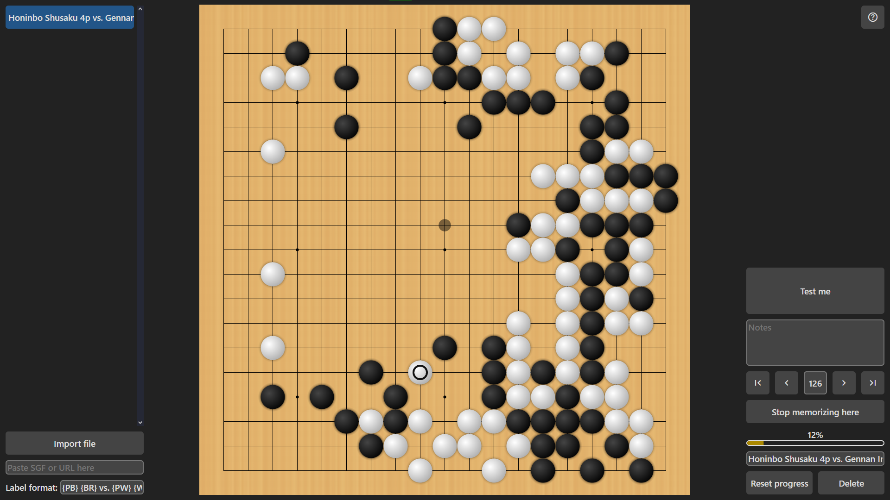

# Ankifu

Ankifu is an application for memorizing Go game records. Open it here: http://kendallfrey.com/ankifu/

## Game library

The left panel contains a menu for managing your library of game records.

To begin studying a game, click on it in the list.

To add a new game to study, there are several ways to import a SGF game record:

- To load a game from a file (e.g. a .sgf file downloaded from [Go4Go](https://go4go.net/)), click the "Import file" button and choose the file to import.
- To load a game from SGF data directly (e.g. copied to the clipboard from [Sabaki](https://sabaki.yichuanshen.de/)), paste the game data into the "Paste SGF or URL here" field.
- To load a game from a link (e.g. a game on [OGS](https://online-go.com/)), paste the URL of the SGF data into the "Paste SGF or URL here" field.

When you import a game, it will be given a name based on the "Label format" field. Placeholders between `{` and `}` will be replaced with the corresponding properties from the SGF data. For example, `{PB}` will be replaced with the name of the black player, and `{RE}` will be replaced with the result of the game. See [SGF File Format FF[4]](https://www.red-bean.com/sgf/) for more information about the properties available in SGF data.

## Game board

The centre of the screen shows the game board. The board has two main modes:

- Browsing through the game using the move navigation buttons enables learning mode. The next move is shown on the board, and your score is not updated. Clicking on the next move will switch to testing mode.
- Playing moves on the board enables testing mode, where you can play moves by memory. As you proceed through the game, your score is updated. If you make a mistake, the board will switch back to learning mode to show you the next move.

## Game study

The right panel contains a menu for studying the selected game.

Click the "Test me" button to go to a random position in the game. It is more likely to choose moves that you have made mistakes on in the past. You can also use the space bar as a shortcut for this button.

The "Notes" field allows you to make notes about specific moves. The notes are hidden in testing mode.

Use the arrow buttons to navigate through the game using learning mode. You can also type in a move number to jump to a specific move. The move number is hidden in testing mode. You can also use the left and right arrow keys, as well as the Home and End keys, as shortcuts for these buttons.

The "Stop memorizing here" button is used to mark the final move to be memorized. It's useful for excluding dame moves, or if you only want to memorize part of a game. Moves after this point will not be included in your score and will not be shown in test mode.

Underneath that, a progress bar showing your score is displayed. Try to reach 100%!

Below the score display, you can edit the label for the current game.

The "Reset progress" button will reset your score for all moves in the current game.

The "Delete" button will delete the current game from your library.

## Troubleshooting

Ankifu stores your game library in your browser's local storage. If the page fails to load even after you refresh the page, deleting your data may solve the problem. You can do this by running `localStorage.removeItem("ankifu-data")` in your browser's JavaScript console.